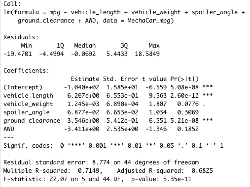

# MechaCar_Statistical_Analysis
A hypothetical car company's, AutosRUs’, upper management has called on their employee, Jeremy, and the data analytics team to review the production data for insights that may help their manufacturing team with their MechaCar prototypes. We like Jeremy and he is fairly new to R, the coding langauge that most of his firm uses; he's a good, albeit hypothetical, guy, so we are going to help him with his analysis.

## Overview
There is a lot for Jeremy and the Data Analytics team to do. Here are some of the questions we will help them answer and deliverables we will assist with: 

- Perform multiple linear regression analysis to identify which variables in the dataset predict the mpg of MechaCar prototypes
- Collect summary statistics on the pounds per square inch (PSI) of the suspension coils from the manufacturing lots
- Run t-tests to determine if the manufacturing lots are statistically different from the mean population
- And, finally, we wiill help design a statistical study to compare vehicle performance of the MechaCar vehicles against vehicles from other manufacturers. 
 
For each statistical analysis, there will be a summary interpretation of the findings.

## Linear Regression to Predict MPG
The multi-variable linear regression to predict mpg was successful at identifying statistially significant variables that contributed to miles per gallon (mpg). With that said, however, our analysis also had room for improvement. Please see the below for our exact findings; below that you will find my methodology and interpretation.

###### Regression Output Predicting MPG

To conduct this analysis, I used the miles per gallon dataset provided by 'management' and loaded it into a dataset. I used mpg as my dependent variable, and vehicle length, vehicle weight, spoiler angle, ground clearance, and all wheel drive (AWD) as independent variables. After executing the regression, I found that two variables had a non-random amount of variance / a correlation with mpg, and with a high level of confidence as that (denoted by the three asteriks). The significant variables were vehicle length and ground clearance. Taking these two statisitcally significant variables into account, I can confirm that the slope of the linear model is not/should not be considered zero. At a high level, the model predicts the mpg of the MechaCars with an accuracy rate of roughly 71%, denoted by our r-squared.

## Summary Statistics on Suspension Coils
The manufacturing team has a design specification requiring that the suspension coils maintain a varaiance that does not exceed 100 lbs per square inch (PSI); we reviewed a dataset provided on the suspension coils and using summary() and group_by() functions in R, we sought to investigate if the design specification requirement was being followed.

At a high level, we found that the variance followed the design specification. Below are the summary statistics for the all of the lot producing the MechaCar prototype.

###### Statistics for All Lots

However, upon furhter investigation into each individual lot, we also found that one of the three lots, Lot3 had a variance of 170 which did not meet the specification. Lot3's failure needs to be raised to management. The details for each lot are below.

###### Statistics with Breakdown by Lot

## T-Tests on Suspension Coils
We performed four sepearate t-tests to determine if the manufacturing lots were statistically different from the mean population concerning PSI. When analyzed at a high level, or rather all of the lots in the same t-test, and analyzed at the per lot level, the t-tests revealed that the the alternative hypothesis (that all or an individual lot did not have a mean PSI of 1500) could be rejected. The results of the four t-tests are below. 

###### T Test on All Lots

.png)

###### T Test on Each Individual Lot

.png)

## Study Design: MechaCar vs Competition
